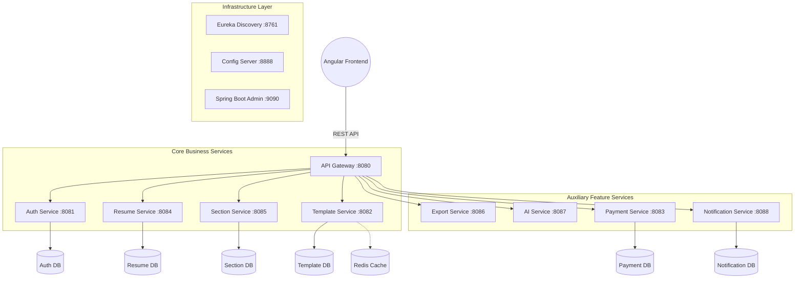
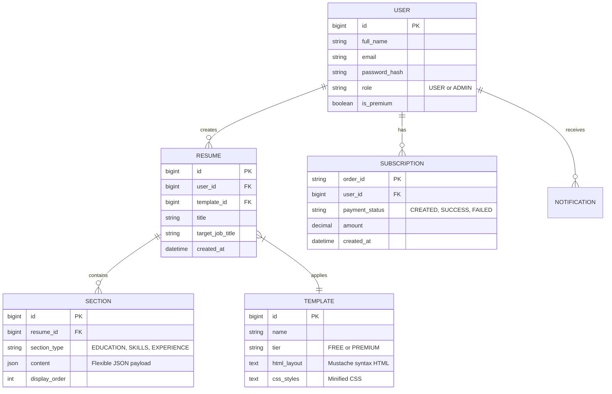
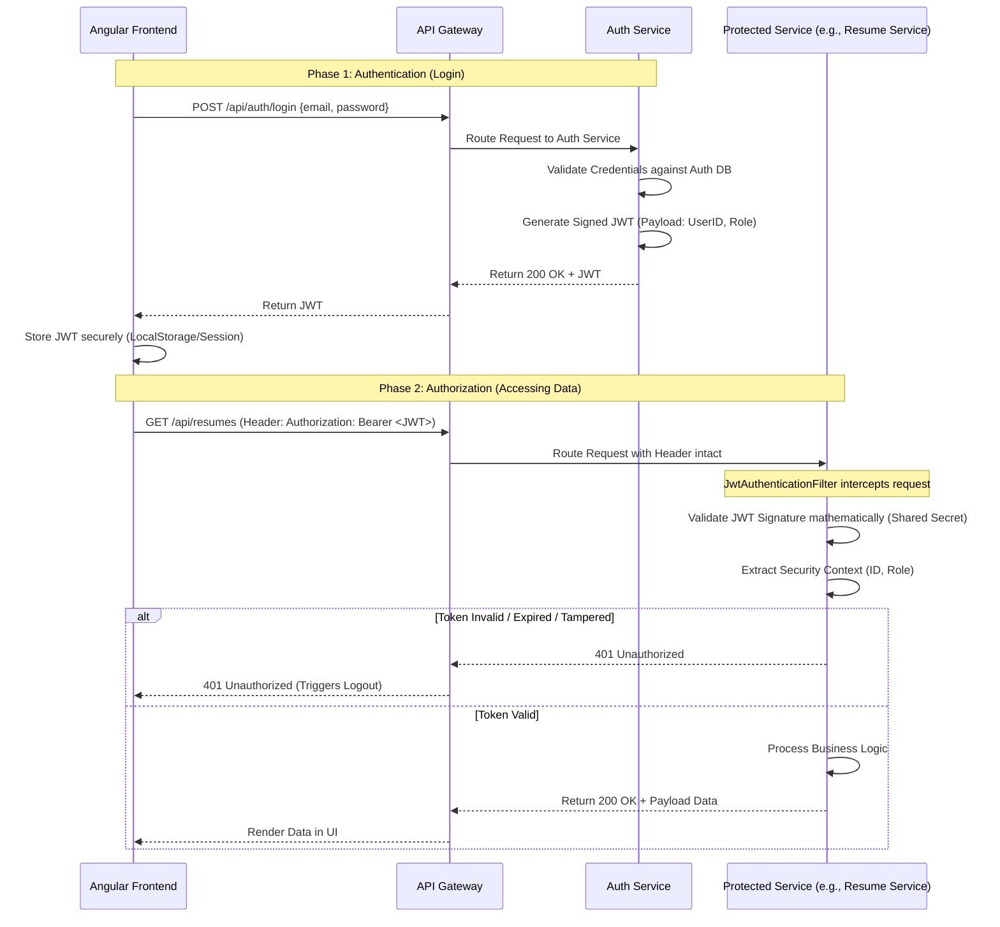
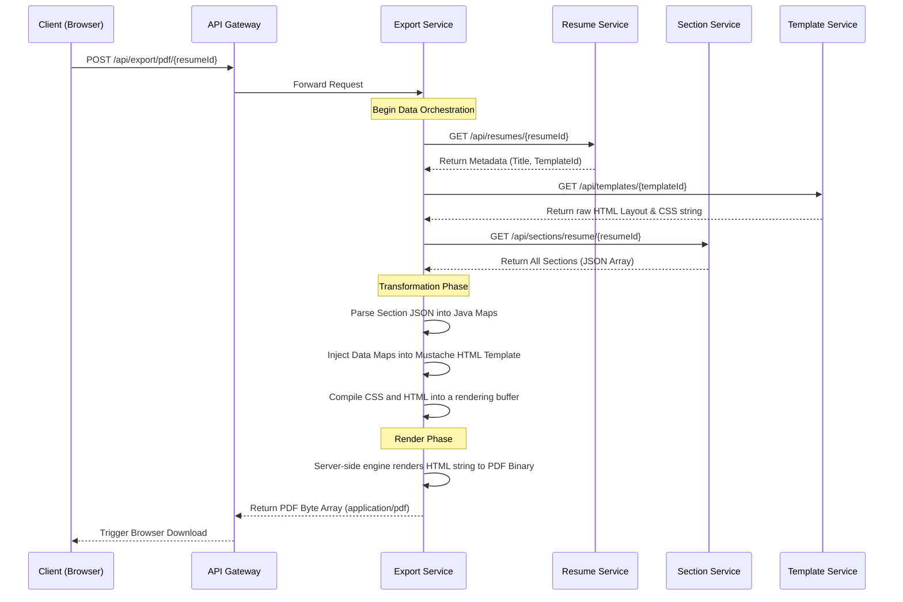

# ResumeAI: AI-Powered Resume Builder Platform (Backend)
**Current Branch:** `feature/UC10-Quality-Testing`

## 📌 Project Overview / Introduction

**ResumeAI** is a full-stack AI-Powered Resume Builder platform designed to empower job seekers to create, optimize, and export professional resumes with the help of cutting-edge AI language models. 

The platform utilizes an AI-powered content layer to generate and optimize resume content for multiple user flows. The current backend setup is configured around a **Groq-backed OpenAI-compatible API** (using models like `llama-3.1-8b-instant`). This allows the `ai-service` to generate professional summaries, write bullet points, provide ATS feedback, and translate resumes at lightning-fast speeds through a single provider.

Features include:
*   Intelligent content generation for Professional Summaries and work experience bullet points.
*   **ATS Compatibility Scoring** against target job descriptions.
*   Automated resume customization to perfectly match live job postings.
*   Exporting dynamic visual CV templates directly to PDF and DOCX formats.
*   **Payment & Subscriptions:** Full Razorpay integration for unlocking Premium tier features via a dedicated microservice.

This repository holds the backend microservices ecosystem powering these platform features.

---

## 🏗 Phase 1 (Infrastructure Layer)

Phase 1 focuses exclusively on the core IT structural foundation that routes, monitors, and configures the future business logic deployments.

## Architecture Overview

This project is built using **Java 17** and **Spring Boot 3.5.13**, following popular distributed systems patterns alongside Spring Cloud.

### Infrastructure Microservices (Phase 1)

| Service Name | Port | Description |
| :--- | :--- | :--- |
| **`eureka-server`** | `8761` | **Service Discovery:** Acts as the phonebook for the architecture. |
| **`config-server`** | `8888` | **Centralized Configuration:** Provides a centralized location to manage properties. |
| **`admin-server`** | `9090` | **Health & Monitoring:** visual dashboard to monitor health and metrics. |
| **`api-gateway`** | `8080` | **Routing Gateway:** [Swagger UI](http://localhost:8080/swagger-ui.html) - Single entry point for all frontend client requests. |
| **`notification-service`** | `8087` | **Alerts & Broadcasts:** Manages real-time alerts, email notifications, and admin-led broadcasts. |
| **`payment-service`** | `8088` | **Financial Transactions:** Handles Razorpay orders, subscription verification, and plan syncing. |

## How to Run

To start the infrastructure layer locally, open four separate terminal windows and navigate into each directory. You must start the services using Maven (`mvn spring-boot:run`).

For the smoothest startup sequence, start the services in the following order:

1. **Start Eureka Server**
   ```bash
   cd eureka-server
   mvn spring-boot:run
   ```
   *Dashboard:* [http://localhost:8761](http://localhost:8761)

2. **Start Config Server**
   ```bash
   cd config-server
   mvn spring-boot:run
   ```

3. **Start Admin Server**
   ```bash
   cd admin-server
   mvn spring-boot:run
   ```
   *Dashboard:* [http://localhost:9090](http://localhost:9090)

4. **Start API Gateway**
   ```bash
   cd api-gateway
   mvn spring-boot:run
   ```
   *Swagger UI:* [http://localhost:8080/swagger-ui.html](http://localhost:8080/swagger-ui.html)

---

## 🚀 Phase 2 (Business Logic)

This phase introduces the core business and user identity layer of the ecosystem.

### Auth Service

| Service Name | Port | Description |
| :--- | :--- | :--- |
| **`auth-service`** | `8081` | **Identity Management:** Handles registration, robust JWT authentication, and LinkedIn/Google OAuth2 integration. (Note: Payment logic migrated to `payment-service`). |

### How to Run Phase 2

For the business logic to function, ensure your infrastructure services (especially Eureka) and your MySQL database are running. 

1. **Start Auth Service**
   ```bash
   cd auth-service
   mvn spring-boot:run
   ```
   *Auth APIs Swagger UI:* [http://localhost:8081/swagger-ui.html](http://localhost:8081/swagger-ui.html)

---

## 🛠 Required Updates for Frontend & Google Auth

The following configurations are necessary to link the backend with the frontend and enable Google/LinkedIn OAuth2 login.

### 1. Environment Configuration (`.env`)
Create a `.env` file in the root directory to store sensitive Google and Database credentials:
```properties
GOOGLE_CLIENT_ID=your_id.apps.googleusercontent.com
GOOGLE_CLIENT_SECRET=your_secret_key
LINKEDIN_CLIENT_ID=your_linkedin_client_id
LINKEDIN_CLIENT_SECRET=your_linkedin_client_secret
API_GATEWAY_URL=http://localhost:8080
AUTH_DB_PASSWORD=your_mysql_password
# Other vars: AUTH_MAIL_USERNAME, AUTH_MAIL_PASSWORD, etc.
```

### 2. Google Cloud Platform Setup
To enable **Google Sign-In**, add the following to your OAuth 2.0 Credentials in GCP:
- **Authorized JavaScript origins:** `http://localhost:4200`
- **Authorized redirect URIs:** `http://localhost:8080/login/oauth2/code/google`

### 3. LinkedIn Developer Portal Setup
To enable **LinkedIn Sign-In**, add this redirect URL in the LinkedIn app Auth settings:
- **Authorized redirect URL:** `http://localhost:8080/login/oauth2/code/linkedin`

### 4. Frontend Connection via API Gateway
The Angular application (`localhost:4200`) should call the API Gateway:
- **Auth Endpoint:** `http://localhost:8080/api/v1/auth`
- **Google OAuth Initiation:** `http://localhost:8080/oauth2/authorization/google`
- **LinkedIn OAuth Initiation:** `http://localhost:8080/oauth2/authorization/linkedin`

---

## 🎨 Phase 3 (Template Management)

This phase introduces the visual templating engine of the ecosystem.

### Template Service

| Service Name | Port | Description |
| :--- | :--- | :--- |
| **`template-service`** | `8082` | **Resume Template Management:** Handles CRUD operations, rendering, and fetching of professional resume templates. Includes comprehensive Javadoc, standardized JUnit 5/Mockito testing with H2, and global stateless security refactoring. |

### How to Run Template Service

1. **Start Template Service**
   ```bash
   cd template-service
   mvn spring-boot:run
   ```
   *Template APIs Swagger UI:* [http://localhost:8082/swagger-ui.html](http://localhost:8082/swagger-ui.html)

---

## 📄 Phase 4 (Resume Management)

This phase focuses on the creation and lifecycle management of user resumes.

### Resume Service

| Service Name | Port | Description |
| :--- | :--- | :--- |
| **`resume-service`** | `8083` | **Resume Lifecycle Management:** Handles creating, updating, duplicating, and publishing resumes. Includes integration for ATS scoring and links to templates. |

### How to Run Resume Service

1. **Start Resume Service**
   ```bash
   cd resume-service
   mvn spring-boot:run
   ```
   *Resume APIs Swagger UI:* [http://localhost:8083/swagger-ui.html](http://localhost:8083/swagger-ui.html)

---

## 📊 Database Seeding

The microservices are pre-configured to seed the database with professional data on the first run.

- **`auth-service`**: Seeds default `ROLE_USER`, `ROLE_ADMIN`, and a sample user `johndoe` (password: `password123`).
- **`template-service`**: Seeds 5 high-quality resume templates (Professional, Creative, Minimalist, etc.) with real HTML/CSS structures.
- **`resume-service`**: Seeds a sample "Software Engineer" resume for the demo user.

> **Note:** Ensure `spring.sql.init.mode=always` and `spring.jpa.defer-datasource-initialization=true` are active in `application.yml` to ensure data is inserted after schema creation.

---

## 📑 Phase 5 (Modular Content Management)

This phase introduces the `section-service` for modular resume data management.

### Section Service

| Service Name | Port | Description |
| :--- | :--- | :--- |
| **`section-service`** | `8084` | **Modular Resume Sections:** Manages individual resume blocks (Experience, Education, Projects). Optimized with Redis caching for high performance. |

### How to Run All Services (Fast Way)

Use the automated launcher script to start all services in the correct sequence:
```bash

---

## 🤖 Phase 6 (Intelligence Layer)

This phase introduces AI-powered content generation and optimization.

### AI Service

| Service Name | Port | Description |
| :--- | :--- | :--- |
| **`ai-service`** | `8085` | **AI Content Generation:** Uses **Groq's OpenAI-compatible API** (via Spring AI) to generate professional summaries, write bullet points, analyze ATS compatibility, and translate resumes. Implements Quota management for Free users and unlimited access for Premium users. |

### How to Run AI Service

1. **Start AI Service**
   ```bash
   cd ai-service
   mvn spring-boot:run
   ```
   *AI APIs Swagger UI:* [http://localhost:8085/swagger-ui.html](http://localhost:8085/swagger-ui.html)

---

## 🖨️ Phase 7 (Export Management)

This phase handles document generation and download capabilities.

### Export Service

| Service Name | Port | Description |
| :--- | :--- | :--- |
| **`export-service`** | `8086` | **Document Export:** Manages the conversion of web-rendered HTML resumes into portable formats. Handles asynchronous generation requests, integrates PDF rendering via headless browsers/libraries, and tracks export quotas. |

### How to Run Export Service

1. **Start Export Service**
   ```bash
   cd export-service
   mvn spring-boot:run
   ```
   *Export APIs Swagger UI:* [http://localhost:8086/swagger-ui.html](http://localhost:8086/swagger-ui.html)

---

## 🔔 Phase 8 (Notification & Alerts)

This phase introduces real-time user communication and platform-wide announcements.

### Notification Service

| Service Name | Port | Description |
| :--- | :--- | :--- |
| **`notification-service`** | `8087` | **Communication Engine:** Handles in-app alerts, email dispatches for OTPs/Welcome messages, and administrative broadcast functionality. Supports marked-as-read tracking and personalized notifications. |

### How to Run Notification Service

1. **Start Notification Service**
   ```bash
   cd notification-service
   mvn spring-boot:run
   ```
   *Notification APIs Swagger UI:* [http://localhost:8087/swagger-ui.html](http://localhost:8087/swagger-ui.html)

---

## 💳 Phase 9 (Payment & Subscription Management)

This phase decouples financial logic into a dedicated service for better security and scalability.

### Payment Service

| Service Name | Port | Description |
| :--- | :--- | :--- |
| **`payment-service`** | `8088` | **Payment Gateway:** Fully integrated with **Razorpay**. Manages order creation, signature verification, and secure activation of premium plans. Synchronizes plan state with `auth-service` via internal Feign APIs. |

### How to Run Payment Service

1. **Start Payment Service**
   ```bash
   cd payment-service
   mvn spring-boot:run
   ```
   *Payment APIs Swagger UI:* [http://localhost:8088/swagger-ui.html](http://localhost:8088/swagger-ui.html)

---

## 🐛 Troubleshooting & Debugging Logs

### Recent Critical Fixes
1. **OAuth2 User Context Fix**: Resolved an issue where OAuth2 logins (Google/LinkedIn) failed to include `userId` and `subscriptionPlan` in the generated JWT token. This caused `401 Unauthorized` errors during resume creation and fetching. `OAuth2SuccessHandler` was updated to accurately map claims.
2. **Template Creation Bug**: Fixed a cascading error where clicking "Use this template" threw a creation failure. The root cause was identified as the missing `userId` in the OAuth JWT, which prevented the backend `resume-service` from correctly linking the new resume to the current user profile.
3. **Circular Dependency Fix**: Resolved a deadlock during startup where `resume-service` and `section-service` were waiting on each other. Implemented `@Lazy` loading for cross-service Feign clients.
4. **Export Service Architecture Simplification**: Removed legacy Apache POI DOCX generation overhead and complex watchdog scheduler logic from the `export-service`. This drastically simplified the backend and eliminated premature timeout failures for long-running export jobs.
5. **Backend Test Coverage Optimization**: Achieved 90%+ branch coverage across all core business microservices to guarantee runtime stability and reliable CI/CD delivery. Optimized `ai-service` specifically to reach **90.7%** branch coverage by simulating complex AI failure modes and quota edge cases.
6. **Dependency Standardization**: Centralized `JwtService` and security filters into a shared infrastructure module, eliminating bean definition conflicts and ensuring unified authentication logic across the distributed ecosystem.
7. **Security & DTO Implementation**: Resolved high-priority SonarQube security warnings in `section-service` and `template-service` by implementing **Data Transfer Objects (DTOs)**. This ensures that internal JPA entities are no longer exposed directly via REST controllers, preventing potential data leaks and structural exposure.
8. **SMTP Health Check Timeout**: Services (`auth-service`, `notification-service`) may falsely report as `DOWN` if the local Antivirus (e.g., McAfee, Avast) or ISP drops outbound connections on port 587 to prevent spam. This was fixed by disabling the Mail health indicator (`management.health.mail.enabled: false`) to ensure the service remains operational despite local SMTP network blocks.
9. **Config Server Health Warning**: A `clientConfigServer` warning with `UNKNOWN` status and `no property sources located` is a harmless warning indicating the optional config server did not return specific properties. It does not affect the actual `UP` status of the services.

---

## ⚒️ Phase 10 (Quality Testing)

Currently, the **feature/UC10-quality-testing** branch of this repository represents **Phase 10** of the architecture. 

## 🛠 Core Infrastructure & Quality Standards

To ensure production-grade reliability and performance, the following technologies are deeply integrated into the architecture:

*   **RabbitMQ (Asynchronous Messaging):** Powers the decoupled execution of AI generation, document exports, and notification broadcasts. This ensures that long-running tasks do not block the main user thread, providing a seamless UX.
*   **Redis (Distributed Caching):** Implemented in high-traffic services like `section-service` to minimize database latency and optimize resume-building performance.
*   **Flyway (Database Migrations):** Manages version control for the database schemas across all microservices. It automatically executes SQL migration scripts on startup (with `baseline-on-migrate` enabled) to ensure that the database state is consistently in sync with the application code.
*   **JaCoCo (Quality Assurance):** Used as the primary metric for code quality. The project maintains a strict **90%+ branch coverage** standard, verified by automated JaCoCo reports, ensuring that all logical paths and edge cases are thoroughly validated.

## 📊 Test Coverage & Quality Assurance

All core business microservices have been optimized to achieve **exceptionally high instruction and branch coverage (90%+)** to guarantee runtime stability, clean exception boundaries, and reliable CI/CD delivery. 

### 🏆 Coverage Dashboard (JaCoCo Verified)

| Microservice | Instruction Coverage | Branch Coverage | Status |
| :--- | :---: | :---: | :---: |
| **`notification-service`** | **100.00%** | **91.30%** | **PASSED** |
| **`resume-service`** | **99.30%** | **93.80%** | **PASSED** |
| **`section-service`** | **99.30%** | **91.40%** | **PASSED** |
| **`ai-service`** | **98.80%** | **90.70%** | **PASSED** |
| **`export-service`** | **97.90%** | **99.40%** | **PASSED** |
| **`template-service`** | **95.83%** | **95.83%** | **PASSED** |
| **`payment-service`** | **95.65%** | **95.65%** | **PASSED** |
| **`auth-service`** | **94.40%** | **91.80%** | **PASSED** |

### 🛠 Running Tests & Generating Reports

To run tests across all microservices and inspect reports locally:
```bash
# Run all unit tests and generate JaCoCo execution files
mvn clean test

# Generate HTML report site for all modules
mvn jacoco:report
```

To view report site:
* **Report path**: `[service-name]/target/site/jacoco/index.html`

> 💡 All unit tests execute purely in-memory using Mockito and mock contexts, ensuring lightning-fast local testing without any database or service runtime overhead.

---

## 🔍 SonarQube Code Quality Analysis

The project is integrated with **SonarQube** for continuous code quality and security inspection. 

### Prerequisites
- **SonarQube Server**: Ensure your local SonarQube instance is running at `http://localhost:9000`.
- **Authentication**: A global User Token is configured in the root `.env` file as `sonar.token`.

### Running Analysis

#### For a single microservice:
Navigate to the service directory and run:
```bash
mvn clean verify sonar:sonar
```

#### For all core services at once (Overall):
From the root directory, run:
```bash
mvn clean verify sonar:sonar -pl ai-service,auth-service,export-service,notification-service,payment-service,resume-service,section-service,template-service -am
```

The `properties-maven-plugin` will automatically load the required token and configuration from the root `.env` file.

### Monitored Metrics
- **Security Hotspots**: Identified and resolved entity exposure issues.
- **Maintainability**: Optimized Java 16+ Stream usage and boolean logic.
- **Code Smells**: Ongoing tracking of technical debt and duplication.
- **Coverage Dashboard**: Links JaCoCo reports directly into the SonarQube dashboard for a unified quality view.

---

## 🏗 System Architecture Diagram



---

## 🗄️ Database Entity-Relationship (ER) Diagram

Following the "Database-per-Service" pattern, each microservice manages its own schema.



---

## 🔐 Sequence Diagram: JWT Authentication Flow

Security is handled via stateless JSON Web Tokens (JWT).



---

## 🖨️ Sequence Diagram: Resume Export Flow



---

## 🚀 Future Enhancements & Scalability Roadmap

1. **Event-Driven Architecture (Message Queues):** Introduce RabbitMQ/Kafka for asynchronous tasks (PDF generation, emails) to prevent bottlenecks.
2. **AI Cover Letter Generator:** Expand `ai-service` to generate targeted cover letters based on Job Description URLs.
3. **LinkedIn OAuth & Profile Import:** Auto-populate Resume Sections instantly via the LinkedIn Profile API.
4. **Advanced ATS Scoring:** Semantic matching engine to provide precise Match Percentage Scores against pasted job descriptions.
5. **Cloud Object Storage:** Migrate to AWS S3 for profile images, PDF backups, and template thumbnails.
6. **WebSockets for Live Collaboration:** Real-time collaborative editing using STOMP over SockJS.

---

## 🐳 Docker Deployment & Orchestration

The entire ResumeAI platform is fully containerized and can be orchestrated using Docker Compose. This ensures a consistent environment across development, testing, and production.

### Using Docker Compose
A centralized `docker-compose.yml` is provided in the backend repository root to seamlessly start the infrastructure (MySQL, RabbitMQ, Redis) and the Spring Boot microservices.

```bash
# Start the full stack in detached mode
docker-compose up -d

# View running containers
docker ps

# Stop the stack
docker-compose down
```

### Benefits of Containerization in ResumeAI:
- **Zero Local Setup:** No need to install Java, Maven, MySQL, or RabbitMQ locally. Docker handles all dependencies.
- **Microservice Isolation:** Each service runs in its own container, preventing dependency conflicts and port clashes.
- **Network Resolution:** Services securely communicate with each other using internal Docker DNS via the `airesume-network` (e.g., `http://auth-service:8081`).
- **Data Persistence:** Persistent Docker Volumes (`mysql-data`) ensure your databases survive container restarts.